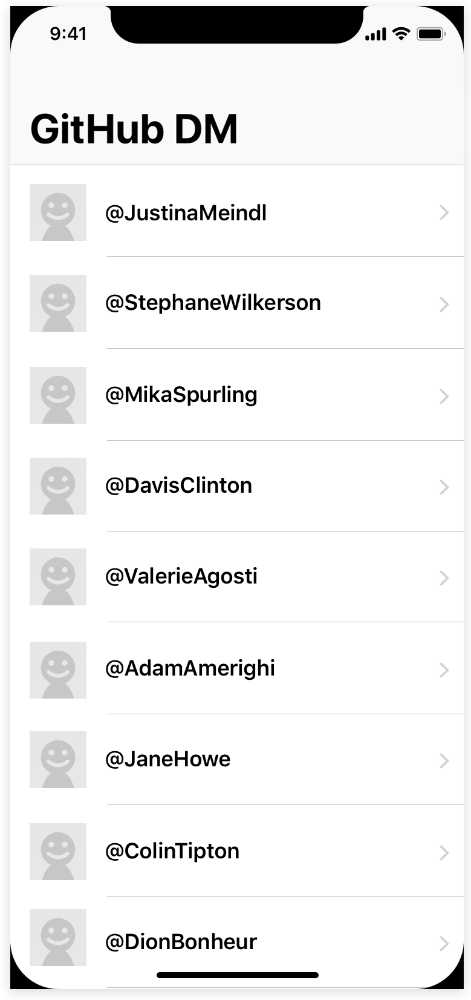

# Task

Write a single-page app that displays a list of GitHub users.

# Minimum Specification

The app must perform the following tasks:

* Display a list of users retrieved from publicly available GitHub user account as initial screen.
* Download, cache and display avatar image urls retrieved from API.
* Use this [GET /users](https://api.github.com/users) endpoint.
* The API can be accessed without auth however, it requires error handling of [rate limit](https://developer.github.com/v3/#rate-limiting). Display the error message informing "Rate limit exceeded".
* The app can be used in both portrait and landscape.

# Minimum Screen Specification

# Additional Optional Specification
You may consider incorporating extra features or improved design. (e.g pull to refresh, avatar placeholders, persistence, unit tests, [pagination](https://docs.github.com/en/rest/reference/users#list-users), etc)

# Guidance for Code Quality 
### Modern Architecture
* Demonstrate best architectural design patterns. (e.g MVC, MVVM, modular, testable, etc)

### Knowledge of Cocoa Touch
* Demonstrate high knowledge of UIKit. (e.g Storyboards, AutoLayout, ConstraintLayout, programmatically UIs, etc)

### Coding Standard
* Write high quality Swift code using standard best practice coding conventions. This includes naming methods and classes, using structs and classes as needed. (e.g. Raywenderlich Swift Style, Git)

# Evaluation Criteria
Implementation of [Minimum Specification](#Minimum-Specification), clearly communicating design decisions and best engineering practices.

# Requirements
* Latest Xcode
* Latest Swift
* Cocoapods or iOS / Cocoa Touch frameworks

# Submission
* Please configure the project/workspace to be able to run simply `CMD + R` or `Product > Run`
* Commit the directory containing the app and your README.md in master branch
* Send it back to your recruitment officer as an attachment in `tar` format